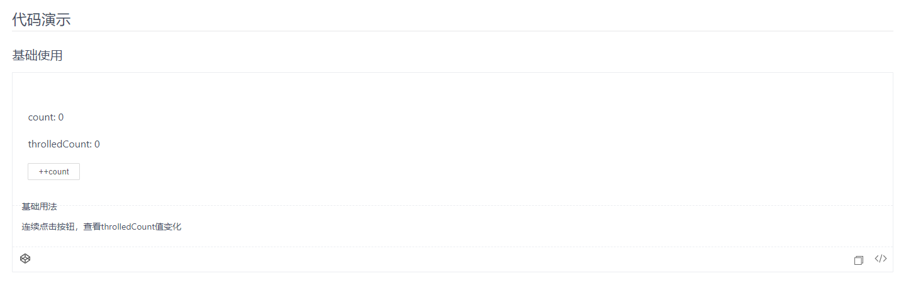
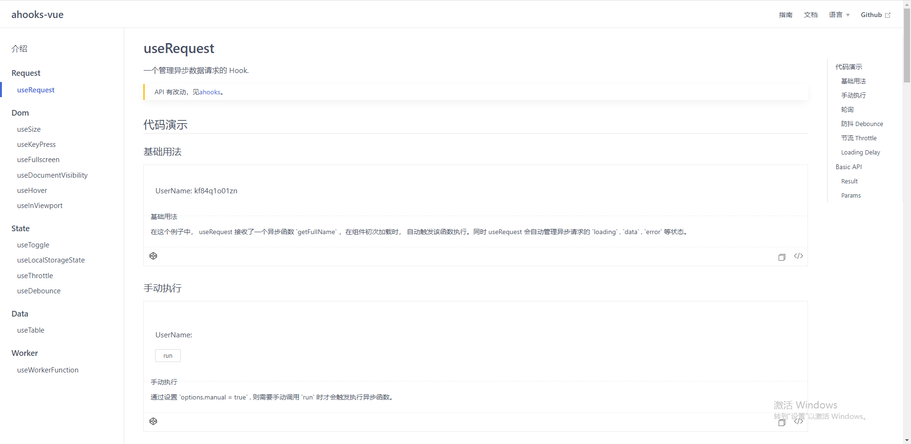

# vitepress-for-component

## vitepress-for-component 是什么?

`VFC` Fork 自[`VitePress`](https://github.com/vuejs/vitepress)，针对**组件开发**场景做了一些功能增强和默认样式修改。

可以理解为是一个在 `VitePress` 的基础上向 [`dumi`](https://d.umijs.org/) 靠拢的工具。

## 详细文档

[https://dewfall123.github.io/vitepress-for-component/](https://dewfall123.github.io/vitepress-for-component/).

## 示例站点

- [ahooks-vue](https://dewfall123.github.io/ahooks-vue/zh/)

## 它做了哪些增强?

### 1. 内置`Demo`组件

我们可以在`.md`文件中这样来引入`demo`。

```md
<demo src="./demo.vue"
  language="vue"
  title="Demo演示"
  desc="这是一个Demo渲染示例">
</demo>
```

渲染效果如下：

<p align="center">
  <br>
  
  <br>
</p>

### 2. 像 dumi 一样的组织文件

在组件编写的场景中，我们觉得 [dumi](https://d.umijs.org/zh-CN/guide) 的文件结构更合适。

#### 示例：

假设我们有这样一个组件库。

`VitePress`文件结构如下。

```
docs
├─ index.md
├─ loading
│  └─ index.md
├─ zh
│  ├─ index.md
│  └─ loading
│     └─ index.md
src
├── loading
│ ├── demo
│ │ └── demo.vue
│ └── loading.vue
└── ...
```

`vitepress-for-componnet`文件结构如下。

```
docs
├── index.en-US.md
├── index.zh-CN.md
src
├── loading
│ ├── demo
│ │ └── demo.vue
│ ├── index.en-US.md
│ ├── index.zh-CN.md
│ └── loading.vue
└── ...

```

我们觉得`dumi`的组织结构有如下好处：

- demo.vue 和 loading.md 都放在 src 下面，源码和文档联系感更强。
- 用后缀`.zh-CN`来区分 locale，更加有对比度。

### 3. 更合适的默认样式

如图：

<p align="center">
  <br>
  
  <br>
</p>
